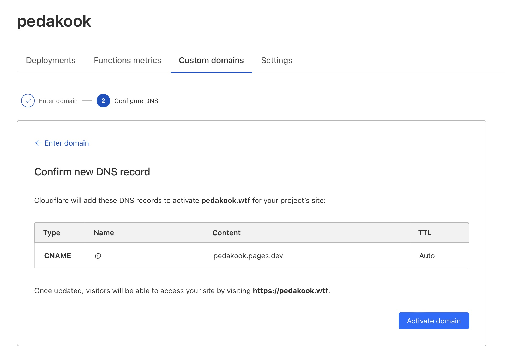

Astro, nagu enamus veebigeneraatoreid, genereerib veebis näitamiseks `npm run build` käsuga *dist* folderi, mille sisu võib tõsta oma veebiserverisse ja leht ongi vastaval aadressil kõigile kättesaadav. Nagu eelmises postituses juttu oli, eeldab see muidugi [node](https://nodejs.org/en) olemasolu arvutis. 

See eeldab oma serveri olemasolu. Ent on ka muid variante – [Cloudflare](https://www.cloudflare.com/en-gb/plans/) näiteks pakub isiklikuks või hobiprojektiks tasuta ruumi, kus saad ka veebiaadressi kujul sinuprojektinimi.cloudflare.dev. Stardiks on see ilmselt täitsa ok.

Mul olid selle projektiga veidi suuremad ambitsioonid, mistap ma registreerisin siinse projekti jaoks domeeni, milliselt seda lehte ka näeb. 

Ent pidevalt muutuva sisuga veebilehe, nagu blogi seda on, pidev täiendamine moel, et iga kord pead faile nö käsitsi serverisse laadima, on tüütu. Seetõttu on mul siin kasutusel lahendus läbi git'i. Ja tegelikult on nii või teisiti arendus läbi git'mõistlik või isegi möödapääsmatu – see võimaldab mitmekesi arendada, parandada, liikuda tagasi vanema versiooni juurde jms. Ja kui juba git kasutusel, siis tõenäoliselt on vaja ka mingit nö eemal asuvat, ehk "remote" repositooriumit. Võib enda oma püsti panna, ent enamjaolt on turvalisem, lihtsam ja muretum kasutada mõnda teenusepakkujat. Minul on selleks [Github](https://github.com/). Õpilastele pakub Github tasuta versiooni.

Githubil on ka endal Github pages nimeline teenus, kus saab oma veebrakendus tööle panna ning siduda ka enda domeeniga. Mina aga kasutan siin Githubi ja Cloudflare ühist ülesehitust. See toimib moel, et mina teen oma arvutis muudatused, lükkan need githubi ja Astro, nöhes, et githubis toimub muutus, laeb automaatselt muudatused alla ning loetud sekundite jooksul toimub avalikus veebis vajalik muudatus. Livesse laskmiseks kasutan eraldi git'i oksa, et arendustööd ja valmis asjad omavahel segamini ei läheks.

