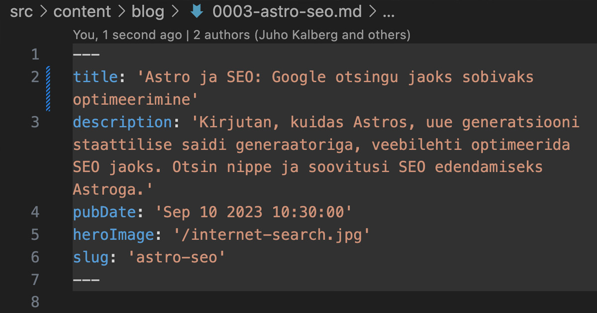

Oma [Frameriga](https://www.framer.com/) tutvumise veebis tegin/teen ma eksperimenti, kuidas mu veeb Googles aja jooksul nähtavale tuleb. Seda võib [lugeda siit](https://vilejakell.studio/esimene-seo-viga). Samad, elementaarsed asjad tuleb ka siin paika sättida.

Seadistada oleks vaja sitemap, SERP, piltide optimeerimine ja ehk midagi veel.  

## SERP'i seadistamine
SERP, ehk *search engine results page* on, nagu nimigi ütleb otsitulemuste leht ja kuidas su veebileht või blogipostitus seal välja näeb.

Kuna siinne blogi ehitatakse arendusarvutis mõnd IDE't kasutades üles, saab siin kasutada rohkem võimalusi. Frameris polnud võimalust seadistada pealkirja, metakirjelduse ega slug'i pikkust automaatselt. Siin aga selgus on vastavad hoiatused juba sisse ehitatud, ehk, et liiga pikkade tiitlite, metakirjelduste või slugide puhul annab programm hoiatuse:


Kasutades IDE't, on võimalus ka mõne pistikprogrammi ehk plugina abil tähti lugeda. Mina kasutan Visual Studio Code'i ja sellele on olemas mõned tähemärkide lugejad. Mulle ülatuseks siiski mitte kõige paremad, ent on. [Installisin selle selekteeritud tähemärkide lugeja.](https://marketplace.visualstudio.com/items?itemName=mousetraps.selected-character-count)

Seejärel avad juba `Shift+CMD+P` käsklusega käsuriba ja otsid sama pistikprogrammi üles ning käivitad, misjärel näidatakse sulle VSCode akna alumises paremas osas tähemärkide arvu:

Sellise seadistuse peab seega teadma, mis on soovitavad lehe tiitlite, metakirjelduste ning slug'i pikkused. Tiitli puhul on see 50-60tm'i, metakirjeldusel 160-165 ja slug'l 3-5 sõna.

## Kuhu Astros tiitel, metakirjeldus ja *Slug* käivad?
Sõltuvalt selles, mis lehega tegu, käsitletakse ka tiitlit, metakirjeldust ja *Slug'i*. Blogipostituses kirjutatakse need Markdown faili Frontmatterisse.

"Frontmatter" on termin, mida kasutatakse staatiliste lehtede generaatorites ja mõnedes sisuhaldussüsteemides (CMS) viidates metaandmetele, mis on tavaliselt paigutatud faili algusesse ja mida kasutatakse lehe või postituse konfigureerimiseks. Ülejäänud sisust eraldatakse ta spetsiaalsete märgenditega, YAML'i ja Markdowni puhul näiteks kolme kriipsuga enne ja pärast.



HTML lehtede puhul on asi veidi keerulisem, ent mitte midagi üle mõistuse käivat. Lehe üldine tiitel ja metakirjeldus asuvad `consts.ts` failis. Neid kasutatakse vaikimisi kõigil lehtedel moel, et imporditakse vastavale lehele sisse.
```javascript
import { SITE_TITLE, SITE_DESCRIPTION } from "../consts";
---

<!doctype html>
<html lang="et">
  <head>
    <BaseHead title={SITE_TITLE} description={SITE_DESCRIPTION} />
  </head>
  ```


Kui nüüd aga tekib soov, ja ilmselt tekib, muuta erinevatel lehtedel tiitlit ja metakirjeldust, siis kirjutatakse need vastava lehe päisesse:
```javascript
---
import Layout from "../layouts/BlogPost.astro";
---

<Layout
  title="Paar sõna minust"
  description="Juho Kalberg – disainer, informaatikaõepetaja, õppur."
  pubDate={new Date("9. august 2023")}
  heroImage="/juho-kalberg.jpg"
>
```  
  
Või kui `Layout`pole kasutusel, siis nii nagu tavapäraselt HTML-is:
```javascript
<head>
    <!-- Tiitel -->
    <title>Astro Blogi Seadistamine: Esimesed Sammud ja Nõuanded</title>
    
    <!-- Metakirjeldus -->
    <meta name="description" content="Avasta, kuidas seadistada oma blogi Astroga, kasutades lihtsaid samme. Tutvu Markdowni vormindamise eelistega ja saa teada, kuidas optimeerida linke Cloudflare'iga.">
    
</head>
```  
  

## Sitemap
Sitemap on tekstifail, milles on sinu veebilehe alamlehtede nimekiri ja ka avaldamise ajad. Google otsing võtab siit infot ja indekseerib selle abil su lehte.

Astros on selle jaoks [integratsioon ja ka paigaldusjuhis](https://docs.astro.build/en/guides/integrations-guide/sitemap/).

Väga lihtne seadistus, peab lihtsalt ülalpool viidatud juhendile vastavalt installima sitemapi integratsiooni `npx astro add sitemap` ja lisama `astro.config.mjs`faili oma kodulehe aadressi:
```js
import { defineConfig } from 'astro/config';
import mdx from '@astrojs/mdx';

import sitemap from '@astrojs/sitemap';

// https://astro.build/config
export default defineConfig({
	site: 'https://pedakook.wtf',
	integrations: [mdx(), sitemap()],
});
```

