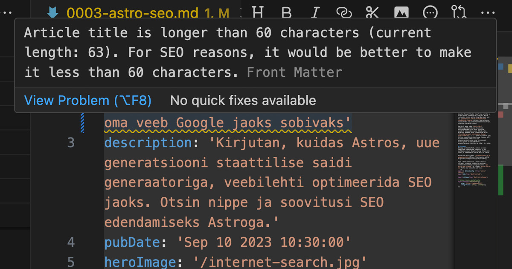
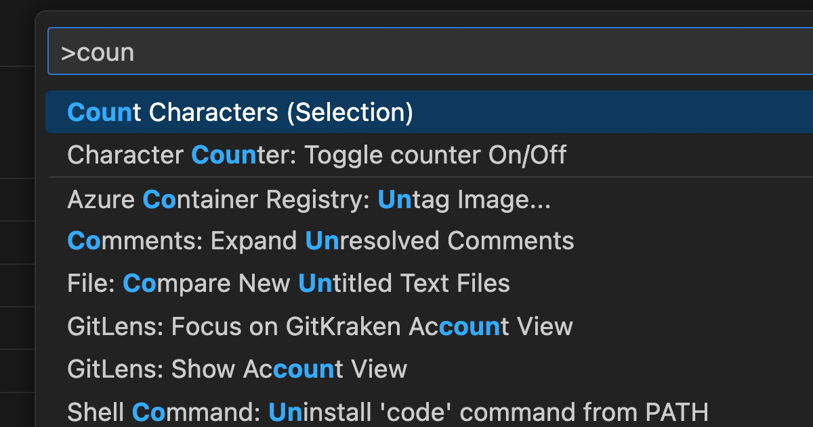

Oma [Frameriga](https://www.framer.com/) tutvumise veebis tegin/teen ma eksperimenti, kuidas mu veeb Googles aja jooksul nähtavale tuleb. Seda võib [lugeda siit](https://vilejakell.studio/esimene-seo-viga). Samad, elementaarsed asjad tuleb ka siin paika sättida.

Seadistada oleks vaja sitemap, SERP, piltide optimeerimine ja ehk midagi veel.  

## SERP'i seadistamine
SERP, ehk *search engine results page* on, nagu nimigi ütleb otsitulemuste leht ja kuidas su veebileht või blogipostitus seal välja näeb.

Kuna siinne blogi ehitatakse arendusarvutis mõnd IDE't kasutades üles, saab siin kasutada rohkem võimalusi. Frameris polnud võimalust seadistada pealkirja, metakirjelduse ega slug'i pikkust automaatselt. Siin aga selgus on vastavad hoiatused juba sisse ehitatud, ehk, et liiga pikkade tiitlite, metakirjelduste või slugide puhul annab programm hoiatuse:


Kasutades IDE't, on võimalus ka mõne pistikprogrammi ehk plugina abil tähti lugeda. Mina kasutan Visual Studio Code'i ja sellele on olemas mõned tähemärkide lugejad. Mulle ülatuseks siiski mitte kõige paremad, ent on. [Installisin selle selekteeritud tähemärkide lugeja.](https://marketplace.visualstudio.com/items?itemName=mousetraps.selected-character-count)

Seejärel avad juba `Shift+CMD+P` käsklusega käsuriba ja otsid sama pistikprogrammi üles ning käivitad, misjärel näidatakse sulle VSCode akna alumises paremas osas tähemärkide arvu:

Sellise seadistuse peab seega teadma, mis on soovitavad lehe tiitlite, metakirjelduste ning slug'i pikkused. Tiitli puhul on see 50-60tm'i, metakirjeldusel 160-165 ja slug'l 3-5 sõna.

## Sitemap
Sitemap on tekstifail, milles on sinu veebilehe alamlehtede nimekiri ja ka avaldamise ajad. Google otsing võtab siit infot ja indekseerib selle abil su lehte.

Astros on selle jaoks [integratsioon ja ka paigaldusjuhis](https://docs.astro.build/en/guides/integrations-guide/sitemap/).

Väga lihtne seadistus, peab lihtsalt ülalpool viidatud juhendile vastavalt installima sitemapi integratsiooni `npx astro add sitemap` ja lisama `astro.config.mjs`faili oma kodulehe aadressi:
```js
import { defineConfig } from 'astro/config';
import mdx from '@astrojs/mdx';

import sitemap from '@astrojs/sitemap';

// https://astro.build/config
export default defineConfig({
	site: 'https://pedakook.wtf',
	integrations: [mdx(), sitemap()],
});
```
