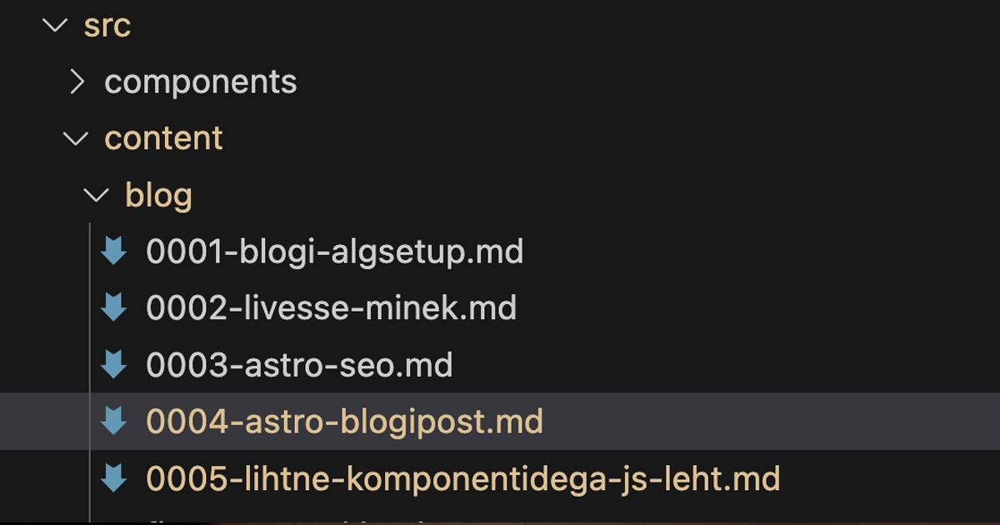

Suure hurraaga alustasin juhendamist, aga unustasin peamise – kuidas siinsesse blogisse kirjutada.

Siinse seadistuse puhul käib blogipostituse kirjutamine markdown failidesse, mis asuvad `src` kataloogi `blog` alamkataloogis.

Kasutatavad pildid asuvad `public`kataloogis.

Markdown faili frontmatterisse kirjutatakse kogu metainfo jms:  
```yaml
---
title: 'Artikli või blogipostituse kirjutamine Astros'
description: 'Kuidas üldse Astos blogida. Vaata ja loe siit.'
pubDate: 'Sep 23 2023 10:30:00'
heroImage: '/astronaut_is_writing_blogpost.png'
heroImageAlt: 'astronaut kirjutab kosmoses blogipostitust'
slug: 'astro-blogisse-kirjutamine'
---
```
Uue postituse loomiseks on mõistlik lihtsalt kopeerida mõni olemasolev.


Et failindust leitavuse huvides korras hoida, võiks nad ära nummerdada: 


Piltidel võiks olla arusaadavad ja postituse sisule viitavad nimed.

NB! Minu soovitus on hoida *slug* ja md-faili nimi sarnased, et uut postitust tehes oleks lihtsam mõnda olemasolevasse linkida, kuna blogikataloogist on lihtsam näha, mis võiks olla faili url, kui iga faili frontmatterist seda vaadata. Seega näiteks võiks siinse postituse failinimi olla `0004-astro-bligisse-kirjutamine.md` ja *slug*´iks `astro-blogisse-kirjutamine`