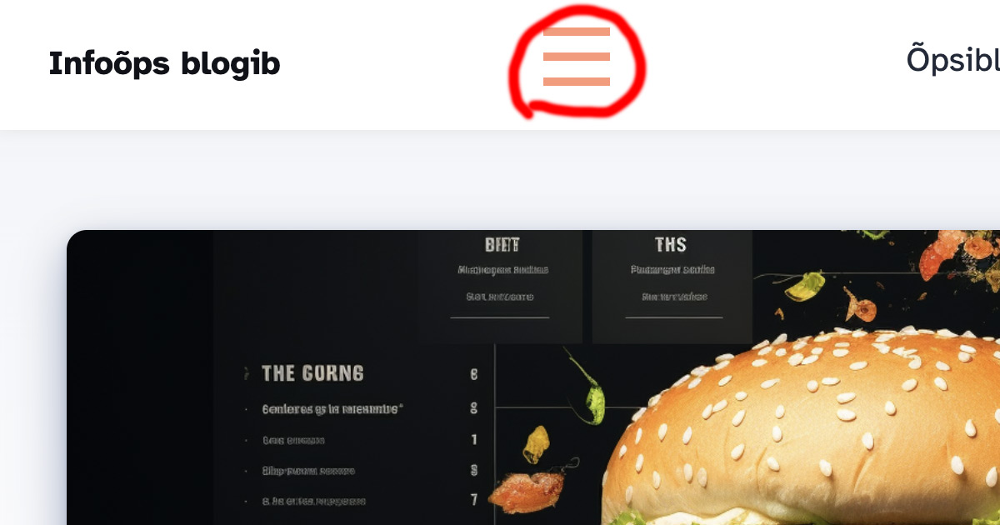

Minu kastutatavas blogitempliidis, [vaata siit selle Astro versiooni algsetupit](/blog/astro-algsetup), ei ole kitsale vaatele kohast menüüd ehk hamburger-menüüd. Hambruger-menüü on selline menüü, mis kitsas vaates on peidus ja avamiseks peab klikkama kolmest horisontaaljoonest koosneval ikoonil, millest ka see hmburgeri nimetus.

## See on järgmine javascriptiga tutvumise ülesanne

Veebist on leitavad valmis menüükomponendid, millised sisaldavad ka hamburgeri-menüüd, ent siinne blogi on õpetamisblogi, siis teeme ise.

[Eelmises javascripti tutvustavas ülesandes](/blog/komponentiga-veebileht-javascripti-abil) päriti moel, et lehelt otsiti kindla ID-ga elementi ning seejärel asendati selle sisu sobilikuga – `document.getElementById(componentId).innerHTML = data;`. Siinses näites aga otsitakse kindla klassinimega element `document.querySelector('.klassinimi')` ning eemaldatakse või lisatakse sellele klasse `classList.toggle('.klassinimi')`.

### Hamburgeri menüükomponendi loomine
Kõigepealt tuleb luua komponentide katloogi (components) sobiva nimega Astro fail. Nt `Hamburger.astro`

Selle sisse lisame HTML-koodi:
```html
---
---
<button class="hamburger">
  <span class="line"></span>
  <span class="line"></span>
  <span class="line"></span>
</button>
```
2x3 kriipsu ülal on frontmatter ja alumine html-kood ongi hamburgeri kolm joont, mis tuleb CSS-is sobivalt täita ja selle css-i võib lisada sama komponendi lõppu `<style></style>`märgendite vahele:
```html
<style>
/* nav styles */
.hamburger {
	cursor: pointer;
    width: 4.5rem;
    padding: 1rem;
    height: 4rem;
    display: flex;
    flex-direction: column;
    justify-content: inherit;
    border: none;
    background-color: transparent;
  }
  
  .hamburger .line {
	display: block;
	width: 40px;
	height: 5px;
	background-color: #ff9776;
  }
</style>
```
<button> element peab see asi antud juhul olema peamiselt sel põhjusel, et nii pääsevad ka erivajadusega inimesed menüüle ligi – seda on võimalik klaviatuuril liikudes avada.

Omakorda tuleb nüüd loodud Hamburgeri komponent importida Header komponenti:
```html
---
import Hamburger from './Hamburger.astro';
...
---
<header>
  <nav>
    <Hamburger />
    ...
  </nav>
</header>
```
Nüüd on kodulehe päises nähtav kolme kriipsuga ikoon:


Kuna seda nuppu on vaja näha vaid mobiilivaates, lisame CSS-i ka `@media` päringu, et alates teatud laiuses hamburgeri menüü ikooni ei näidata:

```html
<style>
...
    @media (min-width: 640px) {
    .hamburger {
        display: none;
        }
    }
</style>
```
Ka seda tuleb teha, et menüü ise läheks kitsas vaates peitu, selleks lisame `Header.astro` faili, milles asub menüüriba, css-kirjed:
```html
<style>
    .nav-links {
    display: none;
  }
  .expanded {
    display: unset;
  }
  @media (min-width: 720px) {
    .nav-links {
      display: block;
    }
  }
</style>
```

### Menüü nähtavaks tegemine ja peitmine *Javascripti* abil.

Järgmiseks on vaja lisada javascript, mis peidab või toob menüü nähtavale, kui meie loodud ikoonil vajutada.

See on lihtne DOM-manioulatsiooni skript, mis lisab või eemaldab valitud elemendile klassi või väärtuse.

Skripti võib kirjutada kohe kõikide lehtede lõppu, enne </body> tagi või nii, nagu ma siin teen, eraldi `js` faili, ning lisada selle link siis kõikide lehtede lõppu.

Siinne *setup* kasutab hetkel ühte layouti, mis on kasutusel nii blogipostituste tegemiseks kui ka *about* lehe jaoks ning lisaks eraldi kujundatud Index.astro tüüpi esilehe jaoks ja Index.astro tüüpi blogi üldlehe jaoks. Neile kõigile peab lisama enne </body> tag'i skripti lingi ja sel juhul ongi see kõikjal, kus vaja. Kui tulevikus luua lehetüüpe või *layout*'e juurse, siis muidugi peab ka neile selle lingi lisama.

Välja näeb see umbes nõnda:
```html
<Footer />
    <script src="../js/main.js"></script>
  </body>
```
Peab arvestama, et `../` hulk sõltub sellest, kui sügaval vastav fail suhtes skripti failiga asub.

Javascript ise näeb välja selline:
```javascript
<script>
    document.querySelector('.hamburger').addEventListener('click', () => {
      document.querySelector('.nav-links').classList.toggle('expanded');
    });
</script>
```
mis tähendab järgnevat:

- `document.querySelector('.hamburger')`: Otsib dokumendist (veebilehelt) esimest elementi, millel on klass hamburger.
- `.addEventListener('click', () => {...})`: Lisab eelnevalt leitud elemendile (`.hamburger` klassiga elemendile) kuulaja, mis reageerib klõpsamisele (click sündmusele).
Kui kasutaja klõpsab `.hamburger` klassiga elemendil, siis käivitatakse funktsioon.
Funktsiooni sees on jällegi `document.querySelector('.nav-links')`: See otsib dokumendist esimest elementi, millel on klass `nav-links`.
`.classList.toggle('expanded')`: See rida muudab `.nav-links` klassiga elemendi klasside nimekirja. Kui sellel elemendil oli juba klass expanded, siis see eemaldatakse. Kui seda klassi ei olnud, siis see lisatakse. See on nagu lüliti, mis lülitab sisse ja välja expanded klassi.

Jälgima peab seda, et menüügrupi klass oleks `.nav-links` või vahetada funktsioonis `.nav-links` selle klassi vastu, mis menüülinkide grupil küljes.

Ja ongi valmis. Et asi ka hea välja näeks, peab seda css-i abil ka stiilima, kuid see on juba järgmise või eelmise postituse teema.